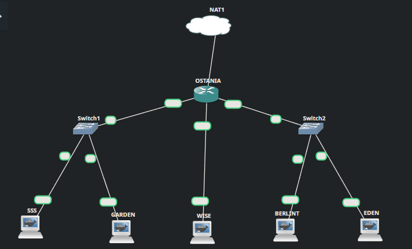
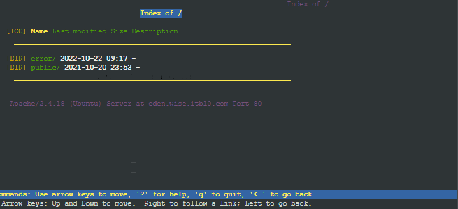

# Jarkom-Modul-2-ITB10-2022

**Jovan Surya Bako 5027201013**		

**Gde Rio Aryaputra Rahadi   5027201063**

## :large_blue_circle: **Soal 1** :large_blue_circle: 

                        gambar topologi

## **IP**

##### Konfigurasi Foosha
```
auto eth0
iface eth0 inet dhcp

auto eth1
iface eth1 inet static
	address 192.219.1.1
	netmask 255.255.255.0

auto eth2
iface eth2 inet static
	address 192.217.2.1
	netmask 255.255.255.0

    
auto eth3
iface eth2 inet static
	address 192.219.3.1
	netmask 255.255.255.0
```
##### Konfigurasi SSS
```
auto eth0
iface eth0 inet static
	address 192.219.1.2
	netmask 255.255.255.0
	gateway 192.219.1.1
```

##### Konfigurasi GARDEN
```
auto eth0
iface eth0 inet static
	address 192.219.1.3
	netmask 255.255.255.0
	gateway 192.219.1.1
```

##### Konfigurasi WISE
```
auto eth0
iface eth0 inet static
	address 192.219.3.2
	netmask 255.255.255.0
	gateway 192.219.3.1
```

##### Konfigurasi BERLINT
```
auto eth0
iface eth0 inet static
	address 192.219.2.2
	netmask 255.255.255.0
	gateway 192.219.2.1
```

##### Konfigurasi EDEN
```
auto eth0
iface eth0 inet static
	address 192.219.2.3
	netmask 255.255.255.0
	gateway 192.219.2.1
```

WISE akan dijadikan sebagai DNS Master, Berlint akan dijadikan DNS Slave, dan Eden akan digunakan sebagai Web Server.

## **1**
 Terdapat 2 Client yaitu SSS, dan Garden. Semua node terhubung pada router Ostania, sehingga dapat mengakses internet. 
 
 pada node OSTANIA harus masukan command
  ``` 
 iptables -t nat -A POSTROUTING -j MASQUERADE -o eth0 -s 192.219.0.0/16
 ``` 
 terlebih dahulu

 setelah itu untuk tiap node nameservernya harus mengarah ke 192.168.211.1 (terkadang bisa berubah)
 dengan menggunakan command 
 ```
 echo "nameserver 192.168.122.1" > /etc/resolv.conf
 ```

## **testing**
 


## **2**
Untuk mempermudah mendapatkan informasi mengenai misi dari Handler, bantulah Loid membuat website utama dengan akses wise.yyy.com dengan alias www.wise.yyy.com pada folder wise\

install bind9
```
apt-get install bind9 -y
```
awalnya konfigurasi pada file
di /etc/bind/named.conf.local

```
zone "wise.ITB10.com" {
        type master;
        file "/etc/bind/wise/wise.ITB10.com";
};
```
lalu buat folder wise pada /etc/bind/  \
lalu buat file wise.ITB10.com dan masukan konfigurasi
 ```
	
$TTL    604800
@       IN      SOA     wise.ITB10.com. root.wise.ITB10.com. (
                        2022102602         ; Serial
                         604800         ; Refresh
                          86400         ; Retry
                        2419200         ; Expire
                         604800 )       ; Negative Cache TTL
;
@             IN      NS      wise.ITB10.com.
@             IN      A       $WISE_IP ; IP WISE
@             IN      AAAA    ::1
www           IN      CNAME   wise.ITB10.com.
 ```
 setelah itu reset bind9 dengan command
 ```
 service bind9 restart
 ```

 selanjutnya tambahkan IP wise sebagai nameserver pada node SSS dan GARDEN  pada /etc/resolv.conf
## **testing**


## **3**
 Setelah itu ia juga ingin membuat subdomain eden.wise.yyy.com dengan alias www.eden.wise.yyy.com yang diatur DNS-nya di WISE dan mengarah ke Eden \
kita tambahkan konfigurasikan pada wise.ITB10.com

 ```
eden          IN      A       192.219.2.3 ; IP Eden
www.eden      IN      CNAME   eden.wise.ITB10.com.
 ```
 lalu di restart bind9 nya

 
## **testing**


## **4**
Buat juga reverse domain untuk domain utama \
tambahkan 
```
zone "3.219.192.in-addr.arpa" {
        type master;
        file "/etc/bind/wise/3.219.192.in-addr.arpa";
};
```
pada file /etc/bind/named.conf.local untuk menentukan zone reverse domainnya \
selanjutnya buat file untuk konfigurasi di /etc/bind/wise/3.219.192.in-addr.arpa \
yang berisikan
```
$TTL    604800
@       IN      SOA     wise.ITB10.com. root.wise.ITB10.com. (
                              2         ; Serial
                         604800         ; Refresh
                          86400         ; Retry
                        2419200         ; Expire
                         604800 )       ; Negative Cache TTL
;
3.219.192.in-addr.arpa.   IN      NS      wise.ITB10.com.
2                       IN      PTR     wise.ITB10.com.
```
## **testing**


## **5**
Agar dapat tetap dihubungi jika server WISE bermasalah, buatlah juga Berlint sebagai DNS Slave untuk domain utama

agar Berlint bisa menjadi slave, konfigurasikan pada file named.conf.local seperti berikut
```
zone "wise.ITB10.com"{
        type master;
 	notify yes;
        also-notify { 192.219.2.2; };
        allow-transfer { 192.219.2.2; };
        file "/etc/bind/wise/wise.ITB10.com";
};
```

setelah itu pada berlint juga dikonfigurasikan named.conf.local nya seperti berikut
```
zone "wise.ITB10.com" {
    type slave;
    masters { 192.219.3.2; }; // Masukan IP WISE tanpa tanda petik
    file "/var/lib/bind/wise.ITB10.com";
};
```
pada named.conf.option perlu juga comment
```
// dnssec-validation auto;
```
dan tambahkan
```
allow-query{any;};
```
pada kedua node (berlint dan wise)
setelah itu restart bind pada kedua node tersebut/\
tambahkan IP berlint pada node SSS sebagai nameserver lalu stop bind9 pada wise dengan command service bind9 stop
## **testing**


## **6**
Karena banyak informasi dari Handler, buatlah subdomain yang khusus untuk operation yaitu operation.wise.yyy.com dengan alias www.operation.wise.yyy.com yang didelegasikan dari WISE ke Berlint dengan IP menuju ke Eden dalam folder operation

konfigurasikan lagi wise.ITB10.com untuk menambahkan delegasi 
```
$TTL    604800
@       IN      SOA     wise.ITB10.com. root.wise.ITB10.com. (
                              2         ; Serial
                         604800         ; Refresh
                          86400         ; Retry
                        2419200         ; Expire
                         604800 )       ; Negative Cache TTL
;
@             IN      NS      wise.ITB10.com.
@             IN      A       $WISE_IP ; IP WISE
@             IN      AAAA    ::1
www           IN      CNAME   wise.ITB10.com.
eden          IN      A       $EDEN_IP ; IP Eden
www.eden      IN      CNAME   eden.wise.ITB10.com.
ns1           IN      A       192.219.2.2 ; IP Berlint
operation     IN      NS      ns1
www.operation IN      CNAME   wise.ITB10.com
```
seperti konfigurasi tersebut kami menambahkan ns1 yang mengarah ke IP berlint

## **testing**


## **7**
Untuk informasi yang lebih spesifik mengenai Operation Strix, buatlah subdomain melalui Berlint dengan akses strix.operation.wise.yyy.com dengan alias www.strix.operation.wise.yyy.com yang mengarah ke Eden .
untuk nomer 7 akan dikonfigurasikan bind9 pada Berlint\
pada named.conf.local , tambahkan zone untuk operation.wise.ITB10.com
```
zone "operation.wise.ITB10.com" {
	type master;
	file "/etc/bind/operation/operation.wise.ITB10.com";
};
```
tambahkan folder operation pada /etc/bind/ dan buat file operation.wise.ITB10.com. pada folder tersebut\
pada file tersebut konfigurasikan seperti berikut
```
$TTL    604800
@       IN      SOA     operation.wise.ITB10.com. root.operation.wise.ITB10.com. (
                              2         ; Serial
                         604800         ; Refresh
                          86400         ; Retry
                        2419200         ; Expire
                         604800 )       ; Negative Cache TTL
;
@          IN      NS      operation.wise.ITB10.com.
@          IN      A       192.219.2.3 ; IP Eden
www        IN      CNAME   operation.wise.ITB10.com.
strix      IN      A       192.219.2.3 ; IP Eden
www.strix  IN      CNAME   strix.operation.wise.ITB10.com.
```
setelah itu di restart bind nya 

## **testing**


## **8 & 9**
(8)setelah melakukan konfigurasi server, maka dilakukan konfigurasi Webserver. Pertama dengan webserver www.wise.yyy.com. Pertama, Loid membutuhkan webserver dengan DocumentRoot pada /var/www/wise.yyy.com\
\
(9)Setelah itu, Loid juga membutuhkan agar url www.wise.yyy.com/index.php/home dapat menjadi menjadi www.wise.yyy.com/home 

install terlebih dahulu apache2 dan apt-get install libapache2-mod-php7.0 -y pada node eden\
dilanjutkan dengan tambahkan file wise.ITB10.com.conf pada /etc/apache2/sites-available \
konfigurasikan seperti berikut
```
<VirtualHost *:80>
        # The ServerName directive sets the request scheme, hostname and port that
        # the server uses to identify itself. This is used when creating
        # redirection URLs. In the context of virtual hosts, the ServerName
        # specifies what hostname must appear in the request's Host: header to
        # match this virtual host. For the default virtual host (this file) this
        # value is not decisive as it is used as a last resort host regardless.
        # However, you must set it for any further virtual host explicitly.
        #ServerName www.example.com
        ServerAdmin webmaster@localhost
        DocumentRoot /var/www/wise.ITB10.com
        ServerName wise.ITB10.com
        ServerAlias www.wise.ITB10.com
        
        <Directory /var/www/wise.ITB10.com/>
                Options +Indexes
        </Directory>
 
        Alias \"/home\" \"/var/www/wise.ITB10.com/index.php/home\"
        # Available loglevels: trace8, ..., trace1, debug, info, notice, warn,
        # error, crit, alert, emerg.
        # It is also possible to configure the loglevel for particular
        # modules, e.g.
        #LogLevel info ssl:warn
        ErrorLog ${APACHE_LOG_DIR}/error.log
        CustomLog ${APACHE_LOG_DIR}/access.log combined
        # For most configuration files from conf-available/, which are
        # enabled or disabled at a global level, it is possible to
        # include a line for only one particular virtual host. For example the
        # following line enables the CGI configuration for this host only
        # after it has been globally disabled with "a2disconf".
        #Include conf-available/serve-cgi-bin.conf
</VirtualHost>
```
untuk document rootnya sudah diarahkan ke /var/www/wise.yyy.com dan ditambahkan alias agar url www.wise.yyy.com/index.php/home dapat menjadi menjadi www.wise.yyy.com/home \

buat folder wise.ITB10.com pada /var/www/
download terlebih dahulu isi dari wise.ITB10.com setelah itu unzip ke folder tersebut
```
wget "https://drive.google.com/uc?id=1q9g6nM85bW5T9f5yoyXtDqonUKKCHOTV&export=download" -O eden.wise.zip
```

```
unzip eden.wise.zip
```

```
mv eden.wise/* /var/www/eden.wise.ITB10.com
```
## **testing**
sebelumnya kita perlu mengganti IP wise.ITB10.com pada node wise dan juga pada reverse domainnya


enable wise.ITB10.com dengang command\
```
a2ensite wise.ITB10.com
```
setelah itu reload dengan command
```
service apache2 reload
```
lalu restart apachenya

selanjutnya pada node eden juga harus diinstall lynx \
jika berhasil maka akan menampilkan seperti berikut


## **10-12**
Setelah itu, pada subdomain www.eden.wise.yyy.com, Loid membutuhkan penyimpanan aset yang memiliki DocumentRoot pada /var/www/eden.wise.yyy.com (10). Akan tetapi, pada folder /public, Loid ingin hanya dapat melakukan directory listing saja (11). Tidak hanya itu, Loid juga ingin menyiapkan error file 404.html pada folder /error untuk mengganti error kode pada apache(12)

pastikan untuk membuat folder eden.wise.ITB10.com dan download file dan di unzip ke folder tersebut
```
wget "https://drive.google.com/uc?id=1q9g6nM85bW5T9f5yoyXtDqonUKKCHOTV&export=download" -O eden.wise.zip
```

```
unzip eden.wise.zip
```

```
mv eden.wise/* /var/www/eden.wise.ITB10.com
```


10-11\
buat file eden.wise.ITB10.com.conf pada /etc/apache2/sites-available
dan diisi dengan
```
<VirtualHost *:80>
-
-
        ServerAdmin webmaster@localhost
        DocumentRoot /var/www/eden.wise.ITB10.com
        ServerName eden.wise.ITB10.com
        ServerAlias www.eden.wise.ITB10.com
       
        <Directory /var/www/eden.wise.ITB10.com/public>
                Options +Indexes
        </Directory>
-
-
</VirtualHost>
```
## **10testing**



## **11 testing**


## **12**
untuk nomer 12 bisa ditambahkan konfigurasi pada /etc/apache2/sites-available/eden.wise.ITB10.com.conf
```
        ErrorDocument 404 /error/404.html
        <Files \"/var/www/eden.wise.ITB10.com/error/404.html\">
                <If \"-z %{ENV:REDIRECT_STATUS}\">
                        RedirectMatch 404 ^/error/404.html$
                </If>
        </Files>
```
## **12 testing**
jika pada urlnya kita tambahkan directory yang tidak ada maka akan diarahkan ke /error/404.html


## **13**
oid juga meminta Franky untuk dibuatkan konfigurasi virtual host. Virtual host ini bertujuan untuk dapat mengakses file asset www.eden.wise.yyy.com/public/js menjadi www.eden.wise.yyy.com/js.
tambahkan 
```
        Alias \"/js\" \"/var/www/eden.wise.ITB10.com/public/js\"
```
pada /etc/apache2/sites-available/eden.wise.ITB10.com.conf

## **testing**


## **14-15**
Loid meminta agar www.strix.operation.wise.yyy.com hanya bisa diakses dengan port 15000 dan port 15500 (14) dengan autentikasi username Twilight dan password opStrix dan file di /var/www/strix.operation.wise.yyy (15) \
buat terlebih dahulu file konfigurasi untuk strix.operation.wise.ITB10.com.conf
lalu isikan

```
<VirtualHost *:15000 *:15500>
-
-

        ServerAdmin webmaster@localhost
        DocumentRoot /var/www/strix.operation.wise.ITB10.com
        ServerName strix.operation.wise.ITB10.com
        ServerAlias www.strix.operation.wise.ITB10.com
        <Directory \"/var/www/strix.operation.wise.ITB10.com\">
                AuthType Basic
                AuthName \"Restricted Content\"
                AuthUserFile /var/www/strix.operation.wise.ITB10 
                Require valid-user
        </Directory>
-
-
</VirtualHost>
# vim: syntax=apache ts=4 sw=4 sts=4 sr noet
```

tambahkan juga 
```
Listen 15000
Listen 15500
```
pada /etc/apache2/ports.conf

untuk NO 15, perlu menggunakan command 
```
htpasswd -b -c /var/www/strix.operation.wise.ITB10 Twilight opStrix
```
## **testing**
```
lynx strix.operation.wise.ITB10.com:15000
```


## **16**
setiap kali mengakses IP Eden akan dialihkan secara otomatis ke www.wise.yyy.com \
tambahkan 
```
redirect permanent / http://wise.ITB10.com
```
pada /etc/apache2/sites-available/000-default.conf

## **testing**


## **17**

Karena website www.eden.wise.yyy.com semakin banyak pengunjung dan banyak modifikasi sehingga banyak gambar-gambar yang random, maka Loid ingin mengubah request gambar yang memiliki substring “eden” akan diarahkan menuju eden.png. Bantulah Agent Twilight dan Organisasi WISE menjaga perdamaian! \
pada bagian ini perlu ditambahkan .htaccess pada /var/www/eden.wise.ITB10.com yang berisikan
```
RewriteEngine On
RewriteCond %{REQUEST_URI} !^/public/images/eden.png$
RewriteCond %{REQUEST_FILENAME} !-d 
RewriteRule ^(.*)eden(.*)$ /public/images/eden.png [R=301,L]
```


pada /etc/apache2/sites-available/eden.wise.ITB10.com
```
         <Directory /var/www/eden.wise.ITB10.com>
                Options +FollowSymLinks -Multiviews
                AllowOverride All
        </Directory>
```


## **testing**
jika kita masukan url yang ada substring eden, maka akan di arahkan ke eden.png dan akan di berikan pilihan download atau cancel
```
lynx eden.wise.ITB10.com/edening.png
```


## **Kesulitan dalam pengerjaan**
kesulitan dalam pengerjaan karna awalnya hanya menyimpan file konfigurasi ke root dan memindahkan ke folder-folder tertentu\
\
pada awalnya tidak sempat membuat scriptnya sehingga sering mengerjakan ulang lagi dari awal 


